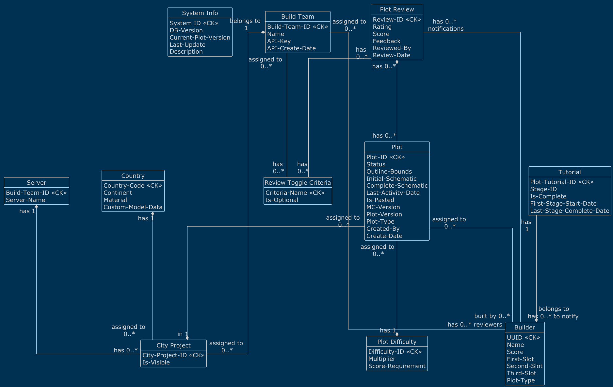

# Plot-System Database Schema

This document provides an overview and explanation of the **PlotSystem Database Schema**.

---

## Schema Overview

The database schema consists of multiple tables within the `plotsystem_v2` schema. These tables handle entities such as
build teams, servers, city projects, plots, builders, reviews, and their relationships.

---

## Tables and Their Purpose

### 1. `build_team`
- **Purpose**: Stores information about teams responsible for building projects.
- **Key Fields**:
  - `build_team_id`: Unique identifier for the team.
  - `name`: Name of the build team.
  - `api_key`: Optional unique API key for external integrations.
  - `api_create_date`: Date the API key was created.

---

### 2. `server`
- **Purpose**: Links servers to specific build teams.
- **Key Fields**:
  - `build_team_id`: References the associated build team.
  - `server_name`: Unique name of the server.

---

### 3. `country`
- **Purpose**: Stores information about countries, including associated materials and continent information.
- **Key Fields**:
  - `country_code`: Unique two-letter country code (e.g., "US", "AT").
  - `continent`: Enum for continent (`EU`, `AS`, `AF`, etc.).
  - `material`: Material representation of the country.
  - `custom_model_data`: Optional custom data for visualization.

---

### 4. `city_project`
- **Purpose**: Represents city projects within specific countries and servers.
- **Key Fields**:
  - `city_project_id`: Unique identifier for the city project.
  - `country_code`: Links to a country.
  - `server_name`: Links to a server.
  - `is_visible`: Indicates whether the project is visible (1) or not (0).

---

### 5. `builder`
- **Purpose**: Stores information about individual builders.
- **Key Fields**:
  - `uuid`: Unique identifier for each builder.
  - `name`: Name of the builder.
  - `score`: Builder's score (default: 0).
  - `plot_type`: Type of plot associated with the builder.

---

### 6. `plot_difficulty`
- **Purpose**: Defines difficulty levels for plots.
- **Key Fields**:
  - `difficulty_id`: Unique identifier for the difficulty (e.g., "EASY").
  - `multiplier`: Score multiplier for the difficulty level.
  - `score_requirement`: Minimum score required for the difficulty.

---

### 7. `plot`
- **Purpose**: Represents individual plots.
- **Key Fields**:
  - `plot_id`: Unique identifier for the plot.
  - `city_project_id`: References a city project.
  - `difficulty_id`: References a plot difficulty.
  - `status`: Enum for plot status (`unclaimed`, `unfinished`, `unreviewed`, `completed`).
  - `score`: Score awarded to the plot (if reviewed).
  - `outline_bounds`: Coordinate boundaries of the plot.
  - `initial_schematic`: Initial schematic data (stored as a BLOB).
  - `complete_schematic`: Final schematic data (optional, stored as a BLOB).
  - `last_activity_date`: Timestamp of the last activity on the plot.
  - `is_pasted`: Indicates whether the plot is pasted into the terra world (1 for true, 0 for false).
  - `mc_version`: Minecraft version associated with the plot.
  - `plot_version`: Version number of the plot.
  - `created_by`: UUID of the builder who created the plot.
  - `create_date`: Timestamp when the initial plot schematic was created.

---

### 8. `tutorial`
- **Purpose**: Tracks builder progress through tutorials.
- **Key Fields**:
  - `tutorial_id`: Unique tutorial ID.
  - `uuid`: Builder's UUID.
  - `stage_id`: Current stage of the tutorial.

---

### 9. `plot_review`
- **Purpose**: Stores reviews for plots.
- **Key Fields**:
  - `review_id`: Unique identifier for the review.
  - `plot_id`: References the reviewed plot.
  - `rating`: Rating given to the plot.
  - `feedback`: Optional feedback from the reviewer.

---

### 10. Relationship Tables
These tables establish relationships between entities:
- **`build_team_has_country`**: Links build teams to countries.
- **`build_team_has_city_project`**: Links build teams to city projects.
- **`build_team_has_reviewer`**: Links build teams to their reviewers.
- **`builder_has_review_notification`**: Tracks notifications sent to builders about reviews.
- **`builder_has_plot`**: Tracks builders and their ownership/membership of plots.

---

## Initial Data
The schema includes pre-defined difficulty levels for plots:
- `EASY` with a multiplier of `1.0`.
- `MEDIUM` with a multiplier of `1.5`.
- `HARD` with a multiplier of `2.0`.
